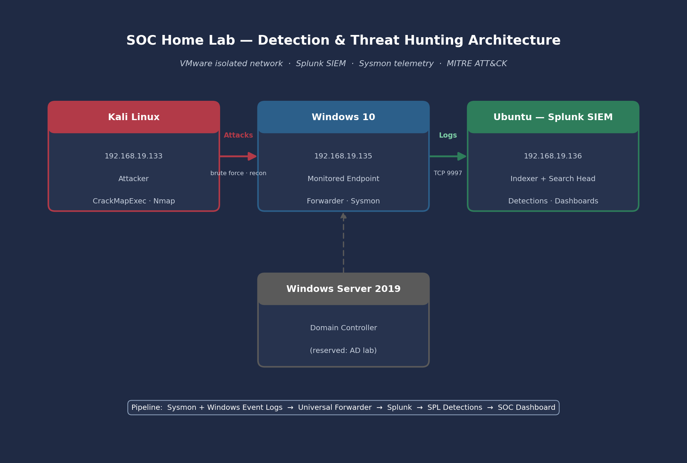
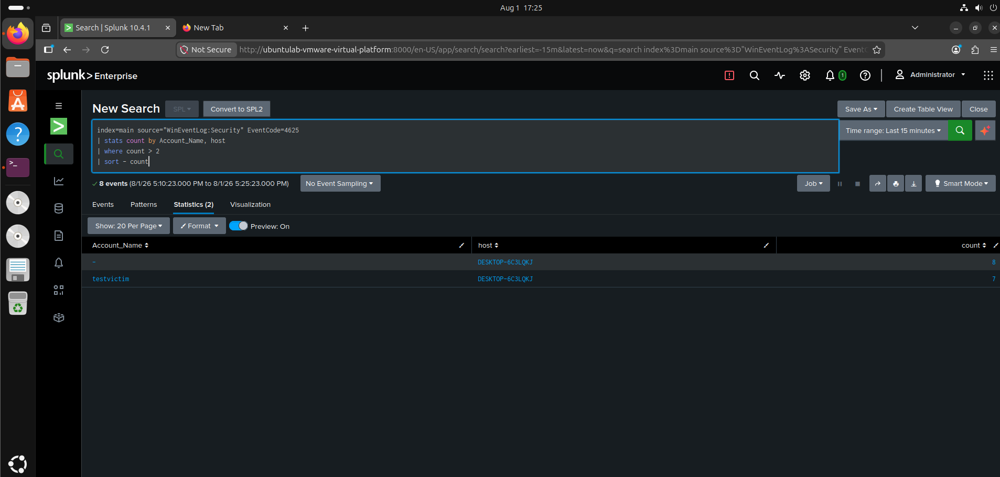
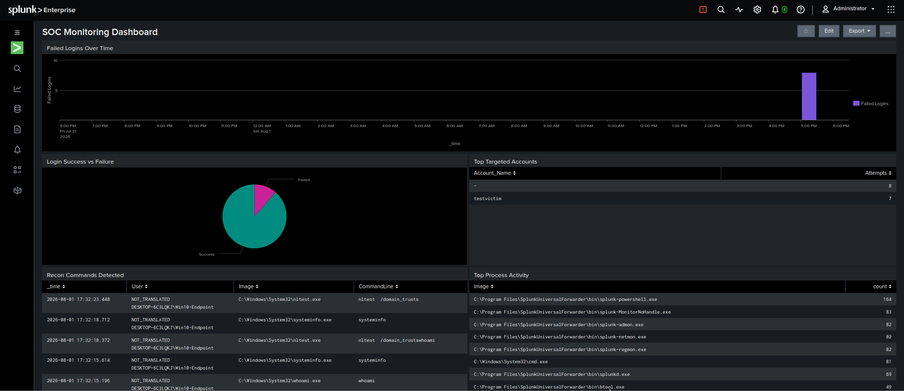
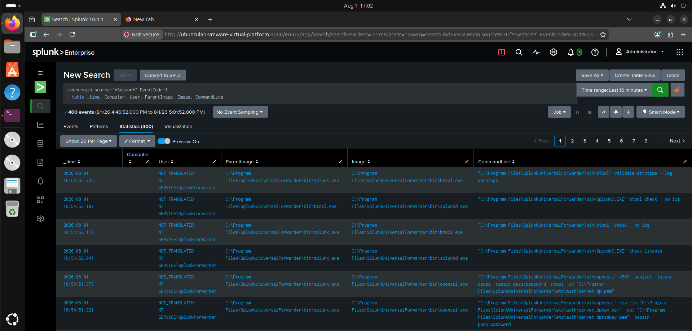

# SOC Home Lab: Detection Engineering & Threat Hunting with Splunk

An enterprise-style Security Operations Center (SOC) home lab built to demonstrate practical **detection engineering**, **log analysis**, and **threat hunting** skills. This project replicates the core workflow of a Tier 1 SOC analyst: collect telemetry, simulate real attacks, detect them with custom queries, and document the findings.


---

## Overview

I built a multi-VM lab environment, deployed **Splunk Enterprise** as a SIEM, and forwarded **Windows Event Log** and **Sysmon** telemetry from a monitored endpoint. I then simulated real-world attacks from Kali Linux, engineered custom **SPL** detections mapped to the **MITRE ATT&CK** framework, visualised the results in a live SOC dashboard, and carried out a hypothesis-driven threat hunt.

The goal was simple: prove I can run the full detection lifecycle end to end — **collect → detect → investigate → document.**

---

## Lab Architecture



```
                    ┌──────────────────────────┐
                    │      Kali Linux           │
                    │   192.168.19.133          │
                    │   (Attacker)              │
                    └────────────┬─────────────┘
                                 │  Attacks (brute force, recon)
                                 ▼
                    ┌──────────────────────────┐
                    │      Windows 10           │
                    │   192.168.19.135          │
                    │   Monitored Endpoint      │
                    │   • Universal Forwarder   │
                    │   • Sysmon                │
                    └────────────┬─────────────┘
                                 │  Logs (Windows Events + Sysmon)
                                 │  TCP 9997
                                 ▼
                    ┌──────────────────────────┐
                    │       Ubuntu              │
                    │   192.168.19.136          │
                    │   Splunk Enterprise SIEM  │
                    │   (Indexer + Search Head) │
                    └──────────────────────────┘
```

| VM | Role | Key Software |
|----|------|--------------|
| **Ubuntu** | SIEM server | Splunk Enterprise (indexer + search head) |
| **Windows 10** | Monitored endpoint | Splunk Universal Forwarder, Sysmon |
| **Kali Linux** | Attacker | CrackMapExec, Nmap |
| **Windows Server 2019** | Domain controller | *(reserved for follow-on Active Directory lab)* |

All machines run in **VMware Workstation** on an isolated NAT network.

---

## Data Pipeline

1. **Sysmon** (with a tuned SwiftOnSecurity configuration) captures deep endpoint telemetry — process creation with full command lines, parent-child process relationships, network connections, and file/registry activity.
2. The **Splunk Universal Forwarder** ships Windows Security/System/Application logs **and** the Sysmon operational channel to the SIEM over TCP 9997.
3. **Splunk Enterprise** indexes the data, where it is searched, correlated, alerted on, and visualised.

---

## Detections Engineered

Each attack was launched from Kali, then detected in Splunk with a custom SPL query and mapped to MITRE ATT&CK.

### 1. Brute-Force Authentication — `T1110`
A password-guessing attack was run against an SMB account using CrackMapExec, generating a burst of failed logons followed by a success.

**Detection logic — flag accounts with excessive failed logons:**
```spl
index=main source="WinEventLog:Security" EventCode=4625
| stats count by Account_Name, host
| where count > 2
| sort - count
```

**Correlated timeline — failure burst followed by successful logon:**
```spl
index=main source="WinEventLog:Security" (EventCode=4625 OR EventCode=4624) Account_Name="testvictim"
| table _time, EventCode, Account_Name, Source_Network_Address
| sort _time
```



### 2. Host & Domain Reconnaissance — `T1087` / `T1082`
Post-compromise discovery commands were executed on the endpoint and detected through Sysmon process-creation logs.

```spl
index=main source="*Sysmon*" EventCode=1
(CommandLine="*whoami*" OR CommandLine="*net user*" OR CommandLine="*net localgroup*"
 OR CommandLine="*systeminfo*" OR CommandLine="*nltest*")
| table _time, User, ParentImage, Image, CommandLine
| sort _time
```

---

## SOC Monitoring Dashboard

A live 5-panel dashboard providing at-a-glance monitoring of the environment:

- **Failed Logins Over Time** — surfaces authentication attack spikes
- **Login Success vs Failure** — breakdown of authentication outcomes
- **Top Targeted Accounts** — accounts under attack, ranked
- **Recon Commands Detected** — discovery activity from Sysmon
- **Top Process Activity** — process execution baseline



---

## Endpoint Telemetry (Sysmon)

Rich process-creation data showing the parent process, executed image, and full command line — the exact fields an analyst uses to investigate suspicious activity.



---

## Threat Hunt

**Hypothesis:** If an attacker brute-forces an endpoint, we should see a spike of failed logons (4625) against a single account, followed by a success (4624) and early discovery commands.

**Method:**
1. Queried failed logons grouped by account — surfaced `testvictim` exceeding the attempt threshold.
2. Correlated the 4625/4624 timeline, confirming a successful logon immediately after the failure burst.
3. Pivoted to Sysmon process logs and confirmed reconnaissance commands (`whoami`, `nltest`, `systeminfo`) on the affected host.

**Findings:** The pattern matched — a successful brute force followed by host and domain reconnaissance, mapping to **T1110** and **T1087 / T1082**.

**Recommendations:** Enforce account lockout policies, alert on per-account 4625 spikes, monitor for clustered discovery commands, and require strong, unique credentials.

---

## Skills Demonstrated

`SIEM Administration` · `Detection Engineering` · `SPL (Search Processing Language)` · `Sysmon`
`Windows Event Log Analysis` · `MITRE ATT&CK` · `Threat Hunting` · `Incident Investigation`
`Log Forwarding & Pipeline Design` · `Attack Simulation` · `Linux & Windows Administration`

---

## Repository Structure

```
splunk-soc-detection-lab/
├── README.md
├── screenshots/
│   ├── architecture-diagram.png
│   ├── sysmon-telemetry-splunk.png
│   ├── brute-force-detection.png
│   └── soc-dashboard.png
├── detections/
│   └── spl-queries.md
└── threat-hunt/
    └── threat-hunt.md
```

---

## Key Takeaways

Building this lab reinforced how much visibility depends on the quality of your telemetry — a tuned Sysmon configuration turns shallow default logs into a rich, investigable data source. It also made the detection lifecycle concrete: an attack is only "detected" when a query reliably surfaces it, and only useful when it's documented clearly enough for someone else to act on.

---

*This lab was built for educational and portfolio purposes in an isolated environment.*
